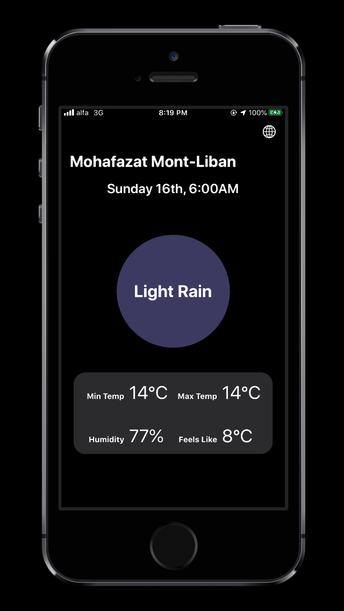
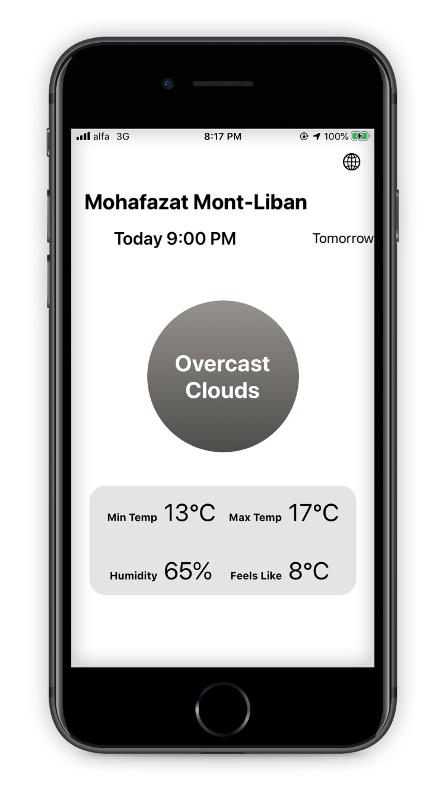
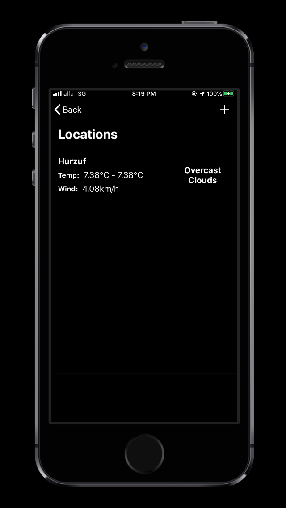

# WeatherApp


WeatherApp uses the OpenWeatherMap API in order to give its users a simple and focused forecast.


## Installation

* Clone this repo
* Run Terminal on your Mac
* Navigate with terminal to the directory containing this repo.
    * Use the ``` cd ``` command to enter directories  
    * Use the ``` ls ``` to display content of directory your are in
* Once you're in the directory, run ``` pod install ```
* After that, open the ```WeatherApp.xcworkspace``` file.
* Once XCode has loaded the project, press the Run or 


## Libraries 

* RxSwift
* RxCocoa

## Screenshots 






## Meta

Mark Debbane – markdebbane@gmail.com

